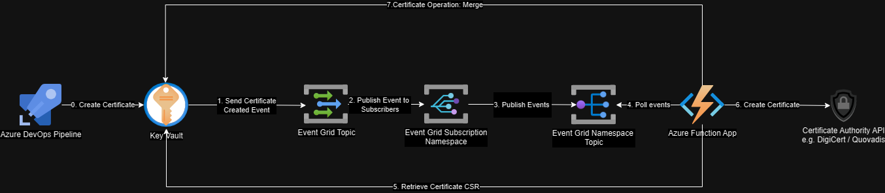

Key Vault -> Event Grid System Topics -> Subscription Namespace -> Namespace Topic <- Pull deliver to Function App (node) -> Key Vault 

Enable namespaces
az provider register --namespace Microsoft.EventGrid
az provider show --namespace Microsoft.EventGrid --query "registrationState"

Validated the response is: "Registered"

To deploy
1. deploy base infra infra/deploy-base.sh
2. deploy app app/csrProcessorEventTriggerJavascript/deploy.ps1
3. create subscription app/deploy-subscription.ps1

To do
1. Create .NET or Java app to retrieve the messages at the subscription
2. Store the result of the operation in keyvault and complete the CSR.
3. Disable private endpoint on namespace topic to get it working
